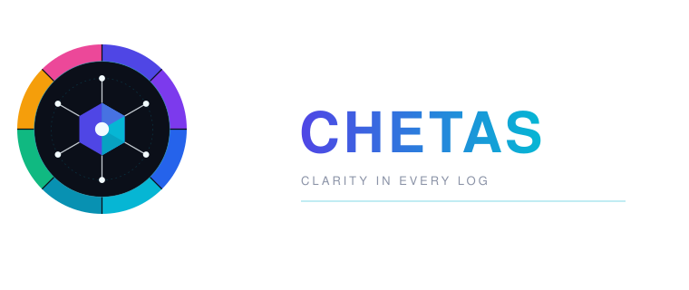
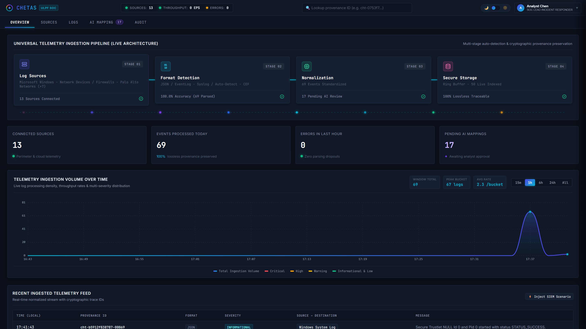
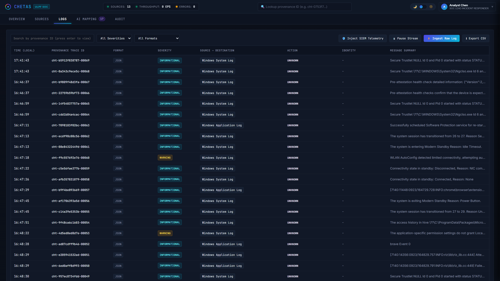
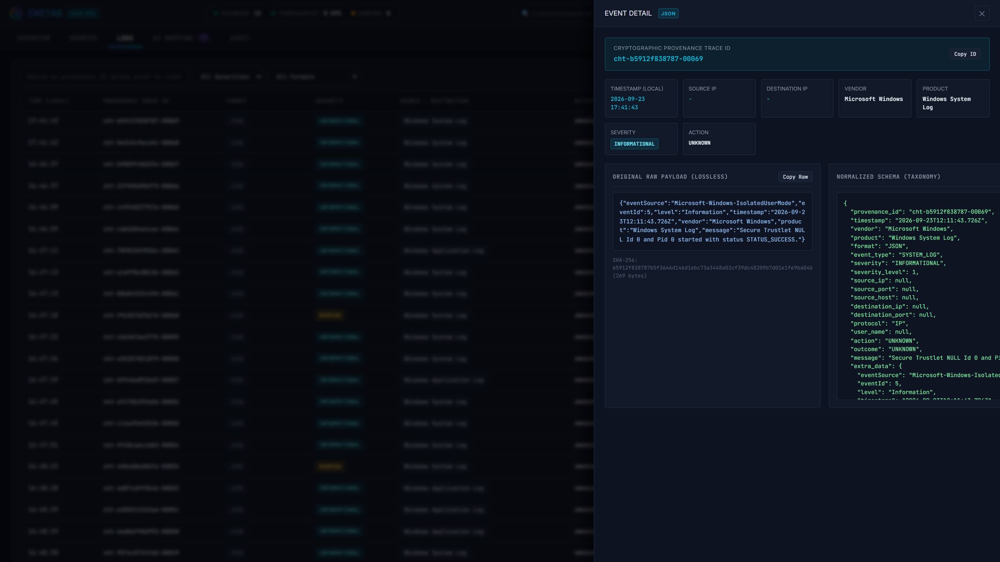
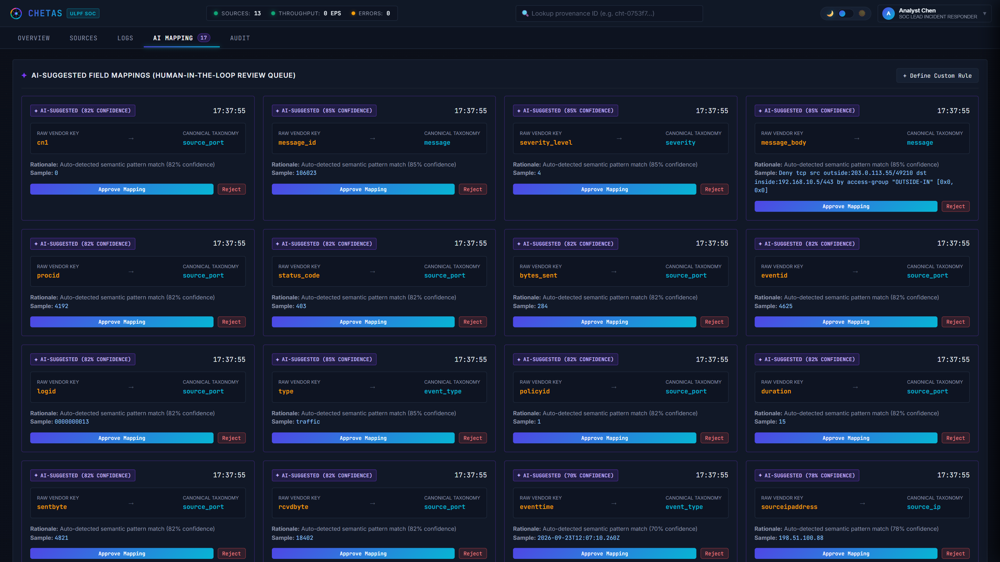

# Chetas — Universal Log Pre-processing Framework (ULPF)

<p align="center">
  
</p>

A lightweight, vendor-agnostic log pre-processing engine and SOC command center. Chetas ingests heterogeneous perimeter and system telemetry (Syslog RFC 3164/5424, CEF, LEEF, Cisco ASA, JSON, Key-Value, Web Access), normalizes them into a unified taxonomy, and guarantees 100% cryptographic raw log provenance.

---

## Overview

Modern security operations centers (SOCs) collect telemetry from dozens of disparate systems: firewalls, cloud infrastructure, domain controllers, proxies, and endpoint agents. In practice:
- Each vendor outputs a distinct, proprietary schema (CEF, LEEF, key-value, raw syslog, JSON).
- Security engineers spend weeks building and maintaining fragile, bespoke Logstash or Fluentd regex pipelines.
- Downstream SIEMs and data lakes ingest bloated, unindexed raw strings, inflating indexing costs and degrading query latency.
- Many pre-processors discard or truncate raw payloads during normalization, compromising legal admissibility and digital forensics chains of custody.

Chetas solves this at the ingestion boundary. It acts as an upstream pre-processing layer that parses incoming events, extracts common security attributes into an OCSF/CIM-aligned taxonomy, assigns a deterministic cryptographic provenance ID, and exposes clean REST endpoints and an operational web console.

```
                           +-----------------------------------+
                           |        Telemetry Ingestion        |
                           |  - UDP Syslog (Port 1514)        |
                           |  - File Watcher (incoming_logs/) |
                           |  - REST API (/api/logs/ingest)   |
                           |  - Windows / Linux Shippers      |
                           +-----------------+-----------------+
                                             |
                                             v
                           +-----------------------------------+
                           |    Auto-Detection & Parser Router |
                           |  Syslog 5424/3164 | CEF | LEEF    |
                           |  Cisco ASA | Key-Value | JSON     |
                           +-----------------+-----------------+
                                             |
                                             v
                           +-----------------------------------+
                           |   Cryptographic Provenance Engine |
                           |  - Byte-exact raw preservation   |
                           |  - SHA-256 digest calculation     |
                           |  - Provenance ID: cht-<hash>-<seq>|
                           +-----------------+-----------------+
                                             |
                                             v
                           +-----------------------------------+
                           |    Universal Normalizer & AI      |
                           |  - OCSF / CIM Canonical Taxonomy  |
                           |  - Dynamic Heuristic / AI Mapping |
                           |  - Human-in-the-Loop Approval UI  |
                           +-----------------+-----------------+
                                             |
                                             v
                           +-----------------------------------+
                           |    Chetas SOC Command Center      |
                           |  - Live Log Stream & Inspector    |
                           |  - Real-time Analytics & Audit    |
                           |  - Downstream SIEM Export Ready   |
                           +-----------------------------------+
```

---

## Key Capabilities

- **Zero-Loss Cryptographic Provenance**: Every incoming event generates a unique identifier formatted as `cht-<sha256[:12]>-<seq>`. The original raw log is preserved unaltered alongside its SHA-256 checksum, establishing bidirectional traceability between normalized records and raw evidence.
- **Multi-Format Auto-Detection**: Automatically identifies and parses payloads without prior vendor declaration, including nested envelopes (such as Syslog RFC 5424 headers encapsulating CEF or LEEF payloads).
- **Normalized Canonical Taxonomy**: Maps disparate source fields to standard attributes (`timestamp`, `source_ip`, `source_port`, `destination_ip`, `destination_port`, `action`, `outcome`, `severity`, `user_name`, `event_type`).
- **Dynamic AI / Heuristic Field Mapping**: When unrecognized proprietary keys appear (e.g. `client_addr_v4`, `s_ip`, `usr_id`), the engine suggests mappings to canonical fields with a calculated confidence score. Analysts can approve, modify, or reject suggestions through the UI or REST API.
- **Real-Time Automated Collectors**: Out of the box, the server runs a UDP Syslog listener on port `1514`, monitors the `incoming_logs/` folder for flat files, and polls local Windows Event Logs.
- **Self-Contained & Air-Gap Ready**: Written in pure Node.js with a vanilla JavaScript and CSS frontend. Requires no external database, Docker container, or cloud dependency to run locally.

---

## Supported Log Formats

| Format / Vendor | Example Sources | Parser Implementation |
|---|---|---|
| **CEF (Common Event Format)** | Palo Alto Networks, Fortinet, ArcSight | `server/parsers/cef.js` |
| **LEEF (Log Event Extended Format)** | IBM QRadar, Microsoft Exchange | `server/parsers/leef.js` |
| **Syslog RFC 5424** | Linux `rsyslog`, systemd, cloud appliances | `server/parsers/syslog.js` |
| **Syslog RFC 3164 (BSD)** | Network routers, legacy firewalls, switches | `server/parsers/syslog.js` |
| **Cisco ASA** | Cisco ASA 5500 Series, Firepower (`%ASA-...`) | `server/parsers/cisco.js` |
| **Key-Value / FortiOS** | Fortinet FortiGate appliances (`key=value`) | `server/parsers/keyvalue.js` |
| **Structured JSON** | AWS CloudTrail, GCP Audit, Azure Monitor | `server/parsers/json.js` |
| **Web Access Logs** | Nginx, Apache HTTPD (Common / Combined) | `server/parsers/webaccess.js` |

---

## Universal Taxonomy Schema

When raw events pass through the normalizer, they are mapped to the following schema:

```json
{
  "provenance_id": "cht-9a4f12bc8801-00042",
  "timestamp": "2026-09-16T14:30:00.000Z",
  "vendor": "Palo Alto Networks",
  "product": "PAN-OS",
  "format": "CEF",
  "event_type": "NETWORK_TRAFFIC",
  "severity": "LOW",
  "severity_level": 2,
  "source_ip": "10.0.1.5",
  "source_port": 1234,
  "source_host": "workstation-01",
  "destination_ip": "8.8.8.8",
  "destination_port": 53,
  "destination_host": "dns.google",
  "protocol": "UDP",
  "user_name": "analyst.chen",
  "action": "ALLOW",
  "outcome": "SUCCESS",
  "message": "Outbound DNS query permitted by edge policy",
  "attributes": {
    "deviceExternalId": "PA-5250-DC1",
    "rule": "Default-Allow-DNS"
  },
  "raw_ref": {
    "raw_sha256": "9a4f12bc8801f92a34c9876e5d...",
    "raw_bytes": 142,
    "ingest_timestamp": "2026-09-16T14:30:01.102Z",
    "source_id": "src-udp-syslog-listener",
    "raw_payload": "CEF:0|Palo Alto Networks|PAN-OS|10.0.0|TRAFFIC|allow|1|src=10.0.1.5 dst=8.8.8.8 spt=1234 dpt=53 msg=Outbound DNS query permitted by edge policy"
  }
}
```

---

## Quick Start

### Prerequisites
- [Node.js](https://nodejs.org/) v18.0.0 or higher
- Windows, Linux, or macOS

### 1. Clone & Install
```bash
git clone https://github.com/11Mandar/Chetas.git
cd Chetas
npm install
```

### 2. Start the Server
```bash
npm start
```
The server will bind to `http://localhost:3000` and start the UDP Syslog collector on port `1514`.

> **Windows Users**: You can double-click `Chetas-Start.bat` to launch the server and open the web dashboard in your default browser. To stop the server later, run `Chetas-Stop.bat`.

### 3. Open the SOC Dashboard
Navigate to `http://localhost:3000` in your web browser. 

Any credential combination can be used to log in for demonstration:
- **Username**: `admin` or `analyst`
- **Password**: Any value (e.g. `admin`)

---

## Ingesting Logs

You can send events into Chetas through any of the following channels:

### 1. HTTP REST API
Send raw log strings or JSON payloads to `/api/logs/ingest`:

```bash
# Ingest raw CEF firewall event
curl -X POST http://localhost:3000/api/logs/ingest \
  -H "Content-Type: text/plain" \
  -H "x-source-id: perimeter-firewall-01" \
  -d "CEF:0|Fortinet|FortiGate|6.4.2|0000000013|traffic:forward|3|src=192.168.1.10 dst=1.1.1.1 spt=54123 dpt=443 proto=TCP act=deny msg=Firewall policy violation"

# Ingest raw Cisco ASA event
curl -X POST http://localhost:3000/api/logs/ingest \
  -H "Content-Type: text/plain" \
  -d "%ASA-4-106023: Deny tcp src outside:198.51.100.5/4532 dst inside:192.168.1.10/80 by access-group OUTSIDE-IN"

# Ingest batch of structured JSON events
curl -X POST http://localhost:3000/api/logs/ingest \
  -H "Content-Type: application/json" \
  -d '{
    "logs": [
      "{\"eventSource\":\"iam.amazonaws.com\",\"eventName\":\"CreateUser\",\"sourceIPAddress\":\"198.51.100.99\",\"userName\":\"secops-admin\"}"
    ]
  }'
```

### 2. UDP Syslog (Port 1514)
Stream events directly from any syslog client, switch, or firewall:

```bash
# Linux / macOS (netcat)
echo '<34>1 2026-09-16T14:30:00Z edge-firewall sshd 4122 - - User root logged in' | nc -u -w1 localhost 1514

# Linux (logger)
logger -d -n localhost -P 1514 -t sshd "Failed password for invalid user admin from 203.0.113.10 port 49152 ssh2"
```

### 3. File Watcher
Drop any `.log`, `.txt`, or `.json` file into the `incoming_logs/` folder in the project root. Chetas reads, normalizes, and moves the processed file to `incoming_logs/processed/` automatically.

### 4. Live Windows Event Shipper
To stream active Windows System and Application logs from any machine on the network to your Chetas instance:
```powershell
# From Windows PowerShell:
.\Stream-Windows-Logs.ps1 -ChetasServerIp "127.0.0.1" -Port 3000

# Or double-click:
Stream-Windows-Logs.bat
```

### 5. Live Linux / WSL Shipper
To stream `journalctl` / `dmesg` logs from Linux or WSL:
```bash
chmod +x Stream-Linux-Logs.sh
./Stream-Linux-Logs.sh http://localhost:3000
```

---

## REST API Reference

| Endpoint | Method | Description |
|---|---|---|
| `/api/status` | `GET` | Returns uptime, event counts, parser distribution, and buffer metrics. |
| `/api/events` | `GET` | Retrieves normalized events. Query parameters: `search`, `severity`, `format`, `source_id`, `limit`. |
| `/api/events/provenance/:id` | `GET` | Look up an event by its provenance ID and retrieve the byte-exact raw payload. |
| `/api/logs/ingest` | `POST` | Ingests single, multi-line, or batch JSON logs. |
| `/api/sources` | `GET`, `POST` | Lists all registered log sources or registers a new source. |
| `/api/ai/mappings` | `GET` | Returns approved mappings and current AI mapping suggestions queue. |
| `/api/ai/approve` | `POST` | Approves a suggested field mapping (`{ id, custom_target }`). |
| `/api/ai/reject` | `POST` | Rejects a suggested field mapping (`{ id }`). |
| `/api/ai/custom` | `POST` | Registers a custom manual key mapping (`{ raw_key, canonical_field }`). |
| `/api/audit` | `GET` | Retrieves the immutable operator action log. |
| `/api/siem/inject-samples` | `POST` | Injects synthetic multi-vendor enterprise test telemetry. |

---

## Running Verification Tests

The repository includes a suite of unit tests verifying all 8 parser modules, the auto-detection router, cryptographic provenance generation, the normalizer, and the AI mapping heuristic:

```bash
npm test
```

Expected output:
```text
=== Chetas ULPF Component Verification Tests ===

1. Testing Provenance ID Generator & Traceability...
  ✓ Provenance ID generated: cht-0753f748de4b-00001
2. Testing Syslog RFC 5424 Parser...
  ✓ Syslog RFC 5424 parsed correctly
3. Testing Syslog RFC 3164 Parser...
  ✓ Syslog RFC 3164 parsed correctly
4. Testing CEF Parser...
  ✓ CEF parsed correctly
5. Testing LEEF Parser...
  ✓ LEEF parsed correctly
6. Testing Key-Value / Fortinet FortiOS Parser...
  ✓ Key-Value parsed correctly
7. Testing Structured JSON Parser...
  ✓ JSON parsed correctly
8. Testing Web Access (Nginx) Parser...
  ✓ Web Access parsed correctly
9. Testing Cisco ASA Parser...
  ✓ Cisco ASA parsed correctly
10. Testing Auto-Detection & Router on Wrapped Syslog-CEF...
  ✓ Auto-detection unwrapped Syslog-CEF correctly
11. Testing Universal Normalizer...
  ✓ Normalized event correctly created with complete provenance
12. Testing AI Field Mapping Engine...
  ✓ AI suggested: client_addr_v4 -> source_ip (95%)
  ✓ Approved mapping successfully applied to dynamic registry

=== ALL 12 COMPONENT TESTS PASSED SUCCESSFULLY! ===
```

---

## SOC Console Screenshots

| Overview Dashboard (Dark Mode) | Live Log Inspector |
|---|---|
|  |  |

| Event Detail & Cryptographic Provenance Drawer | AI Mapping Review & Schema Studio |
|---|---|
|  |  |

---

## Repository Structure

```text
Chetas/
├── server/
│   ├── index.js             # Express API server & routes
│   ├── pipeline.js          # Ingestion coordinator (parse -> provenance -> normalize -> store)
│   ├── provenance.js        # SHA-256 calculation & provenance ID generation
│   ├── normalizer.js        # Canonical field taxonomy mapping & cleanup
│   ├── aiMapping.js         # Heuristic & token similarity field mapping engine
│   ├── collectors.js        # UDP Syslog listener, file watcher, Windows event collector
│   ├── storage.js           # In-memory circular event buffer & audit store
│   ├── siemSamples.js       # Pre-canned enterprise multi-vendor test events
│   └── parsers/
│       ├── index.js         # Auto-detection router & syslog unwrapper
│       ├── cef.js           # CEF parser
│       ├── leef.js          # LEEF parser
│       ├── syslog.js        # Syslog RFC 5424 & RFC 3164 parsers
│       ├── cisco.js         # Cisco ASA parser
│       ├── keyvalue.js      # Key-Value / Fortinet FortiOS parser
│       ├── json.js          # Structured JSON / CloudTrail parser
│       └── webaccess.js     # Nginx / Apache Combined Access log parser
├── public/                  # Frontend single-page application (HTML, CSS, JS)
├── incoming_logs/           # Drop directory for flat file log ingestion
├── scripts/
│   ├── stream_windows_logs.ps1 # Live Windows Event Log shipper
│   └── stream_linux_logs.sh    # Live Linux log shipper
├── tests/
│   └── parser_test.js       # Parser and pipeline unit test suite
├── Chetas-Start.bat         # Windows launcher script
├── Chetas-Stop.bat          # Windows shutdown script
├── Stream-Windows-Logs.bat  # Windows log shipping wrapper
├── Stream-Linux-Logs.sh     # Linux log shipping wrapper
├── package.json
└── README.md
```

---

## Configuration

Server settings can be configured via environment variables:

| Variable | Default | Description |
|---|---|---|
| `PORT` | `3000` | HTTP port for the web dashboard and REST API |
| `SYSLOG_UDP_PORT` | `1514` | UDP port for incoming syslog datagrams |

Example:
```bash
PORT=8080 SYSLOG_UDP_PORT=514 npm start
```
*(Note: Binding to UDP port 514 on Linux typically requires root or `CAP_NET_BIND_SERVICE` privileges).*

---

## License

This project is licensed under the [Apache-2.0 License](package.json).
